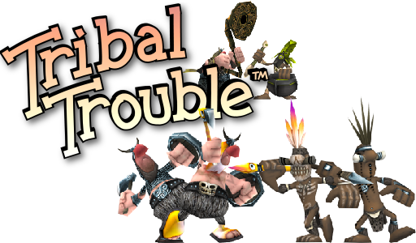
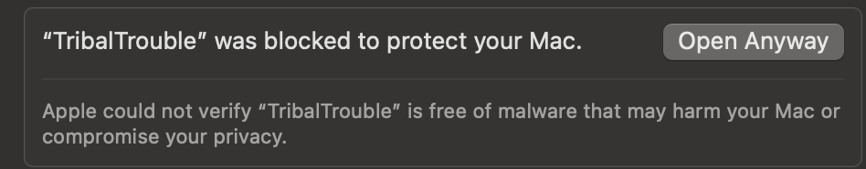

# Tribal Trouble



[](LICENSE)
[](https://github.com/OmarAMokhtar/tribaltrouble/actions/workflows/gradle.yml?query=branch%3Amain)
[](https://discord.gg/tribaltrouble?style=flat)

Tribal Trouble is a realtime strategy game released by Oddlabs in 2004. In 2014 the source was released under GPL2 license.

This fork aims to:

1. Bring the game back online and make it available for everyone to play as it was originally✅
2. Ensure it is easy to build and contribute to development of the game 🚧
3. Remaster and modernize the graphics 🚧
4. Add more playable features later 🚧

See what we're working on right now on the **[current roadmap](https://github.com/users/OmarAMokhtar/projects/1)**.

## Table of Contents

- [🎮 How to play?](#-how-to-play)
- [🛠️ Build Requirements](#️-build-requirements)
- [🏗️ Building](#️-building)
  - [Repository Setup](#repository-setup)
  - [Build + Run Game Client](#build--run-game-client)
  - [Build Game Client for Distribution](#build-game-client-for-distribution)
  - [Build + Run Game Server](#build--run-game-server)
  - [Common Gradle Tasks](#common-gradle-tasks)
  - [Code Formatting](#code-formatting)
- [🚀 Releasing](#-releasing)
- [🤝 Contributing](#-contributing)
- [🌍 Translating](#-translating)
- [🙏 About this fork](#-about-this-fork)

## 🎮 How to play?

The easiest way to play is on **[Steam - Tribal Trouble: Resurrected](https://store.steampowered.com/app/3945720/Tribal_Trouble_Resurrected/)**. You can also grab a build from [tribaltrouble.org](https://tribaltrouble.org) or the releases section of this repo. Come join us on [discord](https://discord.gg/tribaltrouble) - we're still a small community!

Builds from this repo (outside of Steam) are unsigned, so different OSes will respond differently when you launch:

- Linux
  - Launch the `TribalTrouble-x86_64.AppImage`
- Windows
  - Launch the `TribalTrouble.exe`
  - A windows defender modal will pop up. Click more info > run anyway
- Mac
  - Launch the application
  - A modal appears warning the application is unsigned and should be moved to the trash. Click done
  - Go to system settings > Privacy & Security and click Open Anyway:
    

Already played before Steam? See [Migrating Your Save to the Steam Version](./docs/migrate-save-to-steam.md) to bring your campaign progress over.

Reporting a bug or trying to reproduce one? See [Event Logs](./docs/event-logs.md) for where the game writes its per-run logs on each platform and how to replay an `event.log` with `--eventload`.

## 🛠️ Build Requirements

### Client + Server

- [Java SDK 26](https://www.oracle.com/java/technologies/downloads/) (or Open-JDK-26)
- The bundled Gradle wrapper (`./gradlew` / `gradlew.bat`)

### Server

- [mySQL](https://dev.mysql.com/downloads/mysql/)

## 🏗️ Building

Each instruction below assumes you are in a terminal at the root of the repository. Examples use `./gradlew`; on Windows use `gradlew.bat` (or `.\gradlew.bat`) instead.

### Repository Setup

This repo ships a `.gitconfig` with a `.git-blame-ignore-revs` file so the mass-reformat commits don't pollute `git blame`. Git won't auto-load it for security reasons. Run this once from the project root after cloning:

```bash
git config --local include.path ../.gitconfig
```

### Build + Run Game Client

- `gradlew.bat tt:run`

> Steam integration is optional at runtime: `tt:run` works fine without Steam installed or running. If the Steam client is running and `tt/steam_appid.txt` is present (it's committed to the repo), the game will use Steam features (rich presence, achievements, etc.) where it can.

### Build Game Client for Distribution

Build output lands under `tt/build/dist/<platform>` (with shared staged files in `tt/build/dist/common`).

- Linux
  - `./gradlew tt:packageLinux`
- Windows
  - `gradlew.bat tt:packageWindows`
- Mac x86
  - `./gradlew tt:packageMacX86`
- Mac arm64
  - `./gradlew tt:packageMacArm64`

> Each `package*` task only runs on its matching host OS `packageWindows` skips on Linux/Mac, and vice versa.

> Don't want to build locally? CI builds per-platform artifacts on every push to `main` and `release`. Grab them from the [Actions tab](https://github.com/OmarAMokhtar/tribaltrouble/actions/workflows/gradle.yml): pick a successful run and download the platform artifact you want at the bottom of the page.

### Build + Run Game Server

1. mySQL Setup
    - Run `initmysql.sql` against your MySQL server this creates the `oddlabs` database and all base tables.
    - Create the `matchmaker` user and grant it access to the `oddlabs` database (pick any password remember it for the next step):

      ```sql
      CREATE USER 'matchmaker'@'localhost' IDENTIFIED BY '<your-password>';
      GRANT ALL PRIVILEGES ON oddlabs.* TO 'matchmaker'@'localhost';
      FLUSH PRIVILEGES;
      ```

    - Run each migration script in `database/` in numeric order (`001` → `002` → `003` → `004`). They assume you're already in the `oddlabs` database.

2. Server Configuration
    - Copy `server/server.properties.template` to `server/server.properties`
    - Edit the `server.properties` file with your configuration:
      - `SQL_PASS`* - The password for the matchmaker database user
      - `DISCORD_BOT_TOKEN` - Your Discord bot token
      - `DISCORD_SERVER_ID` - Your Discord server ID
      - `WEBSITE_DOMAIN` - Your website domain
      - `NATIVE_CHIEF_EMOJI` and `VIKING_CHIEF_EMOJI` - Emoji IDs for game factions
      - `EMOJI_ROLE_MAPPINGS` - JSON array for Discord role mappings
        > Example: [{"role id":"\<numeric discord role id>","emoji id":"<custom emoji id or unicode (U+1F602)>"}]
      - `REACTION_ROLE_MESSAGE_ID` - Discord message ID for reaction roles

    > Those marked with \* are required to run the game server. Those without \* are optional settings. That are generally used for things like discord integration

3. Run the servers
     - There are two main servers needed. The matchmaker and the router. The matchmaker is what runs the game and most the server logic. The router sends and receives chat messages and other messages from the client
     - **For dev** (foreground, console logs, picks up `server/server.properties`):
       - Matchmaker: `./gradlew server:runMatchmaker`
       - Router: `./gradlew server:runRouter`
     - **For deployment**: extract the server bundle (grab it from the [Actions tab](https://github.com/OmarAMokhtar/tribaltrouble/actions/workflows/gradle.yml) under the `server` artifact), edit `server.properties` in the extracted root, then launch via `bin/matchmaker` / `bin/router`, or the bundled `start.sh` / `start.bat` (which runs both with `nohup` and tees logs to `logs/`)

### Common Gradle Tasks

Quick reference for tasks you'll reach for often:

- `./gradlew clean` - wipe all build outputs
- `./gradlew build` - build every module
- `./gradlew tt:run` - run the game client
- `./gradlew tt:build` - build just the client
- `./gradlew assets:geometry` - regenerate binary geometry files
- `./gradlew assets:textures` - convert texture sources
- `./gradlew tasks --all` - full list of available tasks
- `./gradlew spotlessApply` - auto-fix Java formatting across all modules
- `./gradlew spotlessCheck` - report formatting violations (what CI runs)

### Code Formatting

Java code style is enforced by [Spotless](https://github.com/diffplug/spotless) using the Eclipse JDT formatter, configured from `intellij-java-style.xml` (an export of the project's IntelliJ Java code style). CI runs `spotlessCheck` as a gating step: if any file isn't formatted, the rest of the pipeline doesn't run.

Workflow:

- IntelliJ's format-on-save handles most of it as you edit
- Before committing, run `./gradlew spotlessApply` to smooth over the small gap between IntelliJ's formatter and the Eclipse engine Spotless uses

## 🚀 Releasing

Releases happen in two halves: pushing to `release` publishes to every platform's **prerelease** location (Steam `prerelease` branch, itch `*-prerelease` channels, GitHub Release marked `--prerelease`, website `/prerelease/`). When you're ready to ship to all users, dispatch the **Promote Release to Stable** workflow with the tag. It moves everything to stable destinations. The Steam `default` branch is the one manual step (Valve doesn't let CI touch it).

For the full step-by-step, versioning logic, required secrets, and rollback procedure, see **[docs/releasing.md](./docs/releasing.md)**.

## 🤝 Contributing

Thanks for your interest in contributing. We have a channel in [discord](https://discord.gg/tribaltrouble) that is active with contributors if you have any questions on setup or where to find things. Come chat, play some games!

See something you want or could improve upon? Make a PR or an issue! Don't have an idea? There's plenty of work to be done check out the active issues!

> PRs should target `main`; that's where all work lands before being merged into `release` to ship. See [docs/releasing.md](./docs/releasing.md) for the full flow.

There are ways to contribute besides developing. If you have screenshots of the game from back in the day those are welcome.

> For example a screenshot of the old the leaderboards.

Being an active member in the [discord](https://discord.gg/tribaltrouble) and playing games also will help keep the game going!

## 🌍 Translating

No coding needed: game text is translated in a shared Google Sheet, and a workflow
turns sheet edits into reviewed pull requests automatically. To become a translator,
ask for edit access in the [discord](https://discord.gg/tribaltrouble) or open an
issue, and say which language you want to work on. See
[docs/translations/README.md](./docs/translations/README.md) for how it all works.

## 🙏 About this fork

Accessibility features carried over from the restoration work include UI magnification, high-contrast filter, color-vision-difference correction, editable team colors, keyboard control remapping, and unit/building team-color overlays.

Much of the modernization work this fork is built on came from [bondolo's restoration fork](https://github.com/bondolo/tribaltrouble). If you're looking for the pure restoration experience (no multiplayer/new-feature focus), check it out.
